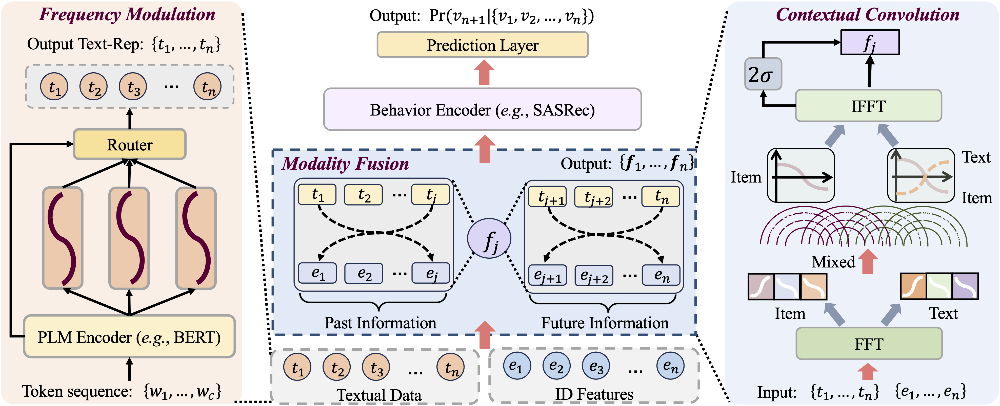
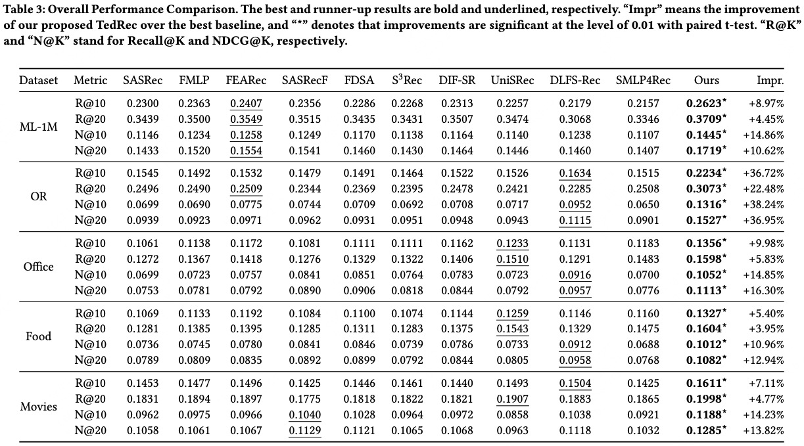

# TedRec

**TedRec** is a novel Text-ID semantic fusion approach for sequential Recommendation. [[paper]](https://arxiv.org/abs/2305.08845).

> Lanling Xu, Zhen Tian, Bingqian Li, Junjie Zhang, Daoyuan Wang, Hongyu Wang, Jinpeng Wang, Sheng Chen, Wayne Xin Zhao. Sequence-level Semantic Representation Fusion for Recommender Systems. CIKM 2024 Applied Research Papers Track.

## [CIKM 2024] Sequence-level Semantic Representation Fusion for Recommender Systems



TedRec mainly consists of two key technical points:
- (i) We modulate the positional embeddings based on mixture-of-experts enhanced adaptor for enriching sequential information into text embeddings. 
As such, it can more distinguishable textual representations for subsequent semantic fusion module. 
- (ii) We propose a mutual filter based operation to fuse ID and text embeddings in the frequency domain, and further employ an inverse FFT to 
produce the integrated representations.

## Dataset Description

As summarized in the following table, our experiments are conducted on five publicly available benchmark datasets, 
considering the platform, scale and sparsity, i.e., MovieLens-1M (ml-1m), Online Retail (OR), Amazon Office, Amazon Food and Amazon Movies.


| Datasets |  #Users  |  #Items | #Interactions | Sparsity |
|:--------:|:--------:|:-------:|:-------------:|:--------:|
|   ml-1m  |   6,040  |  3,416  |      993,571  | 95.1867% |
|    OR    |  16,520  |  3,469  |      503,386  | 99.1219% |
|  Office  |  87,346  | 25,986  |      597,491  | 99.9737% |
|   Food   | 115,349  | 39,670  |      912,064  | 99.9801% |
|  Movies  | 281,700  | 59,203  |    2,945,031  | 99.9823% |


## Quick Start

1. Unzip dataset files. (Note that Food and Movies are too large to be included in this repository)
    ```bash
    cd dataset/
    tar -xzvf ml-1m.tar.gz
    tar -xzvf OR.tar.gz
    tar -xzvf Office.tar.gz
    tar -xzvf Food.tar.gz
    tar -xzvf Movies.tar.gz
    ```
2. Install dependencies.
    ```bash
    pip install -r requirements.txt
    ```
3. Evaluate the performance of our approach on the ml-1m dataset. 
    ```bash
    python main.py -d ml-1m
    ```

## Parameter Configurations

### Configuration files

Parameter configurations consist of three parts/files: 
- overall configuration ([[overall.yaml]](props/overall.yaml))
- model configuration (e.g., [[TedRec.yaml]](props/TedRec.yaml))

### Implementation details

Since our method is model-agnostic, we utilize the representative sequential model based on the backbone of Transformer, i.e., SASRec as the base recommender, and adopt the widely used language model BERT to obtain pre-trained textual representations. 
We implement all models based on the open-source benchmark library RecBole. 
To ensure a fair comparison, we optimize models with the Adam optimizer and cross entropy loss, and the default Xavier distribution is utilized for initializing parameters. Note that in the original implementation, SASRec and DLFS-Rec utilized the pair-wise optimization function, while we implement the list-wise cross entropy loss for them to compare fairly. 
All experiments are conducted on the NVIDIA A100 machine. 

For all models, the training batch size is set to 2,048, and we adopt the early-stopping strategy to finish training when the performance on the validation set does not improve for 10 epochs, and NDCG@10 is set as the indicator. We also tune the learning rate in \{5e-4,1e-3,5e-3\} for the optimal performance. 
Following previous studies, the maximum sequence length for all models is set to 50. 
For self-attention based approaches, the number of the attention head and layers is set to 2, and the inner size and hidden size of Transformer are set to 256 and 300, respectively. For baselines, we carefully search the hyper-parameters following original papers. 
Furthermore, we make our code, logs and datasets public to improve reproducibility for the community of recommender systems in this anonymous repository.


## Performance Comparison

### Logged results of TedRec

Logged results with respect to five datasets are presented as follows: 
- MovieLens-1M ([[tedrec_ml-1m.out]](results/tedrec_ml-1m.out))
- Online Retail ([[tedrec_OR.out]](results/tedrec_OR.out))
- Amazon Office ([[tedrec_Office.out]](results/tedrec_Office.out))
- Amazon Food ([[tedrec_Food.out]](results/tedrec_Food.out))
- Amazon Movies ([[tedrec_Movies.out]](results/tedrec_Movies.out))

### Overall performance of baselines



We have provided more experiments to comprehensively show the effectiveness of TedRec at [[additional_experiments.md]](additional_experiments.md).

## Acknowledgement

Please cite the following paper if you find our code helpful.

```bibtex
@inproceedings{xu2024tedrec,
  author    = {Lanling Xu and Zhen Tian and Bingqian Li and Junjie Zhang and Daoyuan Wang and Hongyu Wang and Jinpeng Wang and Sheng Chen and Wayne Xin Zhao},
  title     = {Sequence-level Semantic Representation Fusion for Recommender Systems},
  booktitle = {{CIKM}},
  publisher = {{ACM}},
  year      = {2024}
}
```

- The experiments are conducted using the open-source recommendation library [RecBole](https://github.com/RUCAIBox/RecBole).
- Thanks for your reading and guidance. If you have any questions, please feel free to give me your advice.
